# Project 3: Design Journey

**For milestones, complete only the sections that are labeled with that milestone.**

Be clear and concise in your writing. Bullets points are encouraged.

**Everything, including images, must be visible in Markdown Preview.** If it's not visible in Markdown Preview, then we won't grade it. We won't give you partial credit either.

**Make the case for your decisions using concepts from class, as well as other design principles, theories, examples, and cases from outside of class.**

You can use bullet points and lists, or full paragraphs, or a combination, whichever is appropriate. The writing should be solid draft quality but doesn't have to be fancy.

## Project 1 or Project 2
> Which project will you add a form to?

Project 2


## Audience (Milestone 1)
> Who is your site's target audience? This should be the original audience from Project 1 or Project 2. You may adjust the audience if necessary. Just make sure you explain your rationale for doing so here.

The audience is Cornell Freshman who are new to the area and are looking to explore local foods and festivals safely during the current pandemic.


## Audience's Needs (Milestone 1)
> List the audience's needs that you identified in Project 1 or 2. Just list each need. No need to include the "Design Ideas and Choices", etc. You may adjust the needs if necessary. However, any changes you make to the needs for this project should be clearly identified and justified.

- TODO: Map of the event
- TODO: Pictures of the event
- TODO: What foods and products are being offered
- ...


## HTML Form + User Needs Brainstorming (Milestone 1)
> Using the audience needs you identified, brainstorm possible options for an HTML form for the site. List each idea and provide a brief rationale for how the HTML form addresses that need.

- A request for more information on a specific restaurants. This form would be them signing up for additional information to provide them on how to get to the specific location and the menu/special offerings.
- A raffle for a discount at any restaurants or product sold at the apple festival. This meets the needs of the audience because they were very interested in the products and foods offered at the event. Holding a raffle for a free product or food would interest them and also allow them to know one of the items offered as they can now redeem that item for free.
- ...


## HTML Form Proposal & Rationale (Milestone 1)
> Make a decision about your site's form. Describe the purpose of your proposed form for your Project 1 or 2 site. Provide a brief rationale explaining how your proposed form meets the needs of your site's audience.
> Note: If your form is a contact form, we expect to see a thorough justification explaining how a contact form addresses the user's _actual_ needs. In your justification explain how a contact form better suits the needs of your user compared to the alternatives (e.g. sending you an email using your email address).

Form Proposal: I will make a raffe that provides users who sign up a random food item or product.

User Needs Rational: The users I interviewed were very interested in learning about the offerings of the Apple Festival, specifically the food. Having a raffle will allow them to learn what they could possibly win, and let them know that the particular item is being sold at a specific store.


## Form User Data (Milestone 1)
> Think through and plan the data you need to collect from the users. Do you need their name? Email address? etc.

- I would need their name for identification purposes, and their email to contact them. Additionally, I would allow them to pick whether they wish to win a product or win a food raffle. I will have a space for food allergies/material allergies so the winner will not get a random product that they cannot use. But since not all users will have an allergy, I will first have radio buttons so the user can specify if they have an allergy. The submit button will be named enter as they are entering a raffle.
- ...


## Form Components & Validation Criteria (Milestone 1)
> For each piece of data you plan to collect from the users, identify an appropriate HTML component to collect that data and decide the validation criteria (e.g. whether this data is _required_). Briefly explain your reasoning for the component choice and the validation criteria.

- Name (required): text field; `<input type="text">` This is required as I need to be able to identify the user that won.
- Email (required and must be a valid email): text field; `<input type="email">`This is required as I need a way to contact the users that won the raffle.
- Product Type (required): checkbox; `<input type="checkbox">` This is in a checkbox as the user can choose what items they want. If they only want to enter the raffle food or only want to enter the products raffle, they can specify that here. They can also select both, meaning they will be entered into both raffles.
- Any allergies? (not-required): radio button; `<input type="radio">` This isn't required as not all users will have an allergy. But if they do, they can select yes and a textarea will pop up allowing them to specify. Users with an allergy can also leave this blank as they may simply choose to give their prize away if they cannot use it.
- Specify allergies: (not-required): text field; `<input type="textarea">` This isn't required as not all users will have an allergy. But if they do, they can specify and so if they're selected to win an item, it won't be an item that could potentially harm them.
- Enter Raffle (required): submit; `<input type="submit">` Enter raffle is informative and tells that user what they're doing when they click the button.

## Form Location (Milestone 1)
> Which HTML file will you place your form?

TODO (index.html)

> Sketch the location of the form in that page. This sketch need not be fancy. You don't need to provide many details of the page or form. Just plan the location of the form on the page and communicate that to us. You can literally have a box that says "FORM HERE."

**Desktop Location**

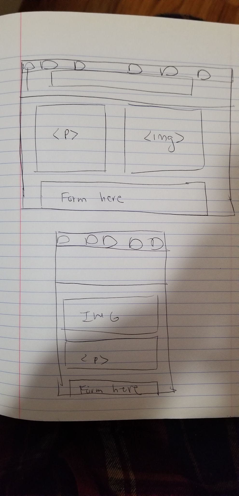


**Mobile Location**


## Form Design (Milestone 1)
> Include sketches on your form below. Include sketches of your **mobile and desktop** versions without corrective feedback. Show us the evolution of your design and the alternatives you considered.

**Desktop Sketches**

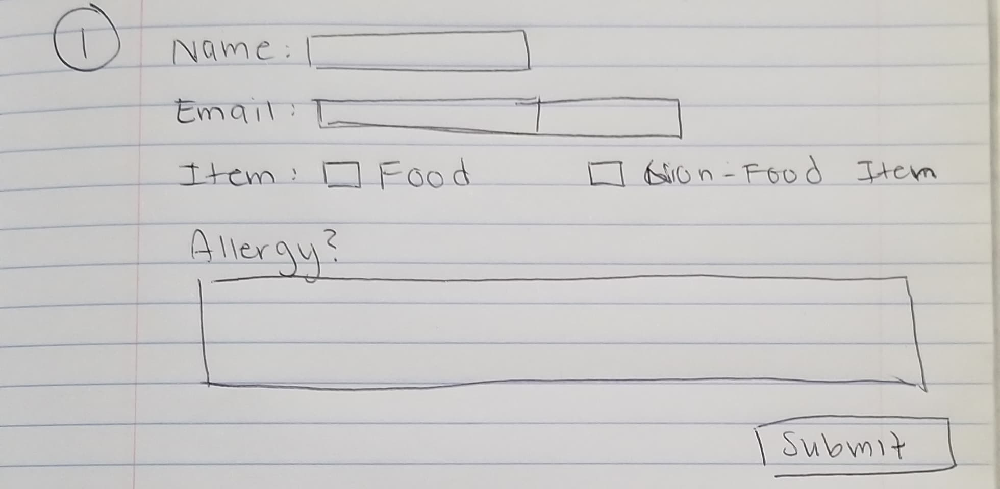

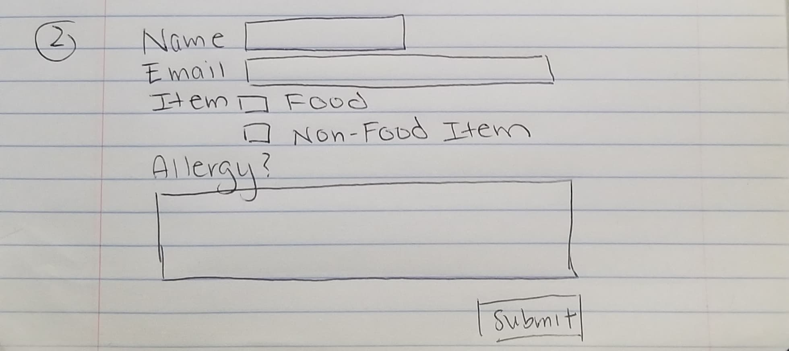
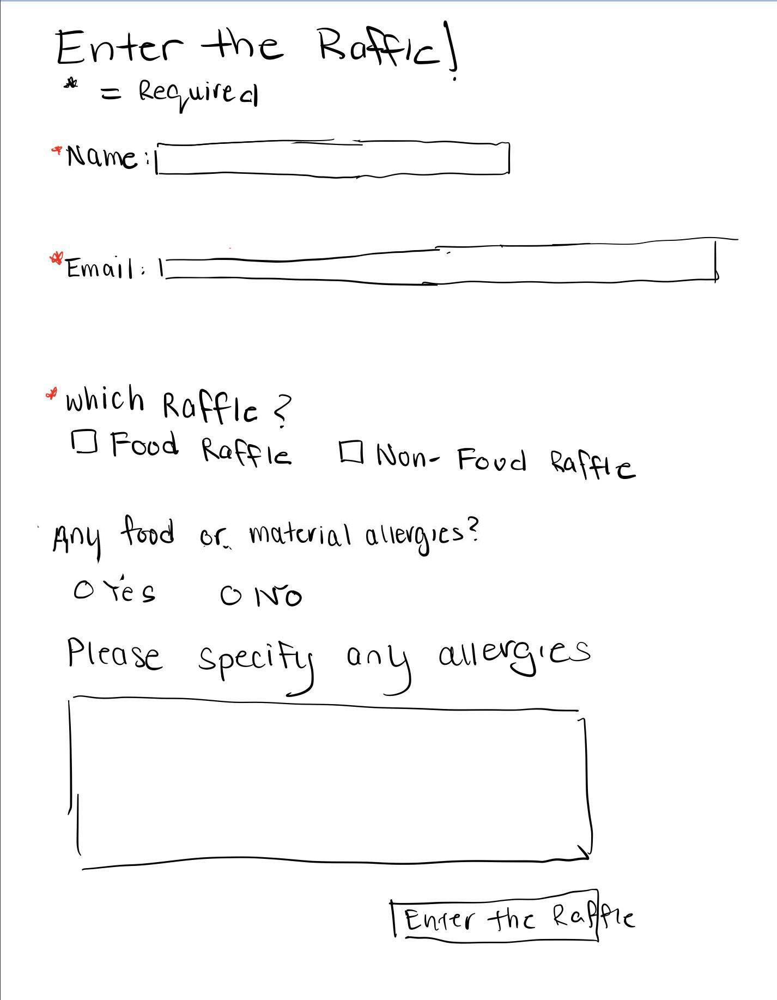


**Mobile Sketches**
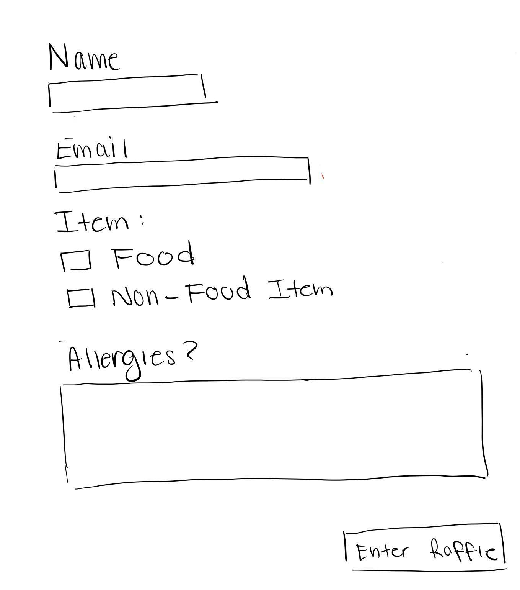

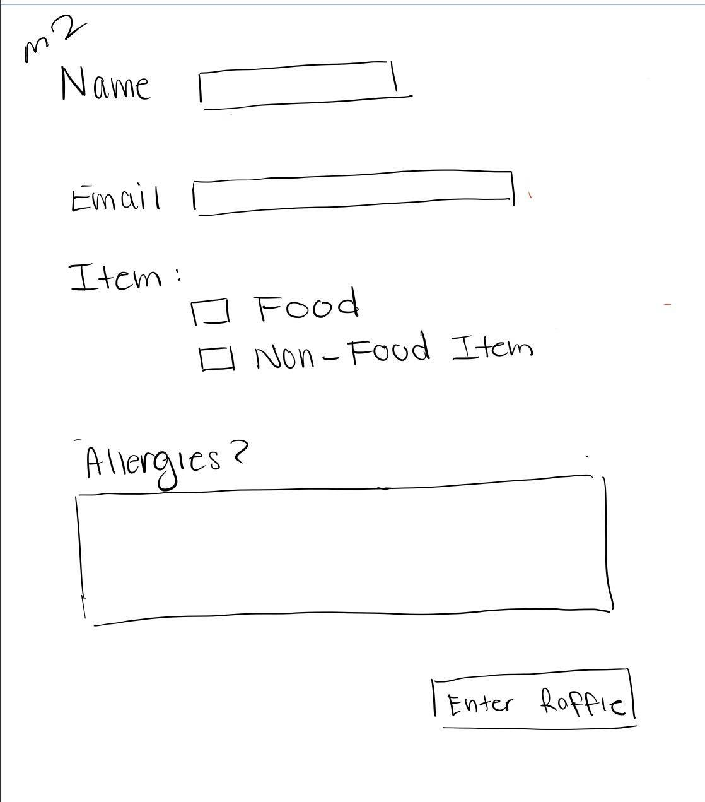


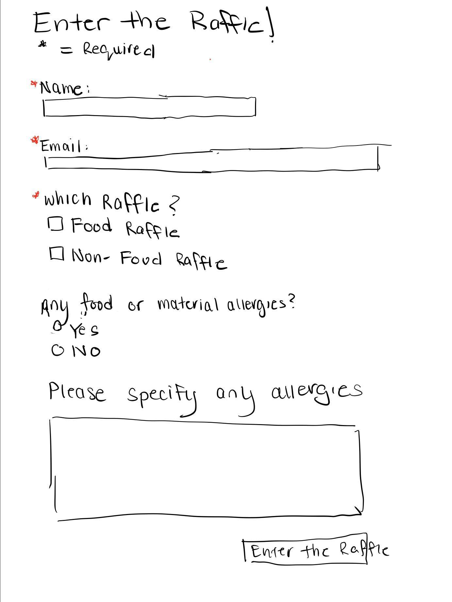

## Form Feedback Design (Milestone 1)
> Include sketches of your **mobile and desktop** with _corrective feedback_. Show us the evolution of your design and the alternatives you considered.

**Desktop Feedback**

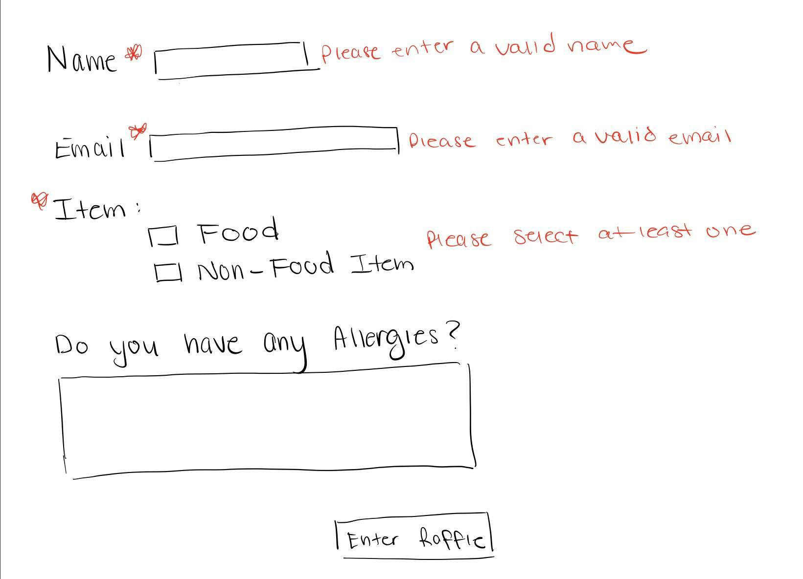


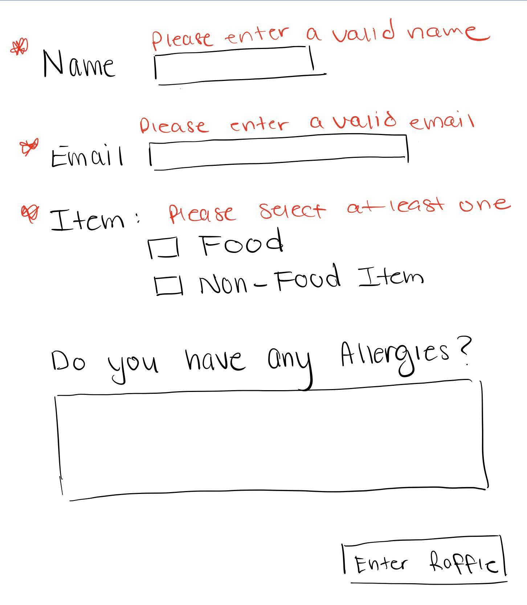

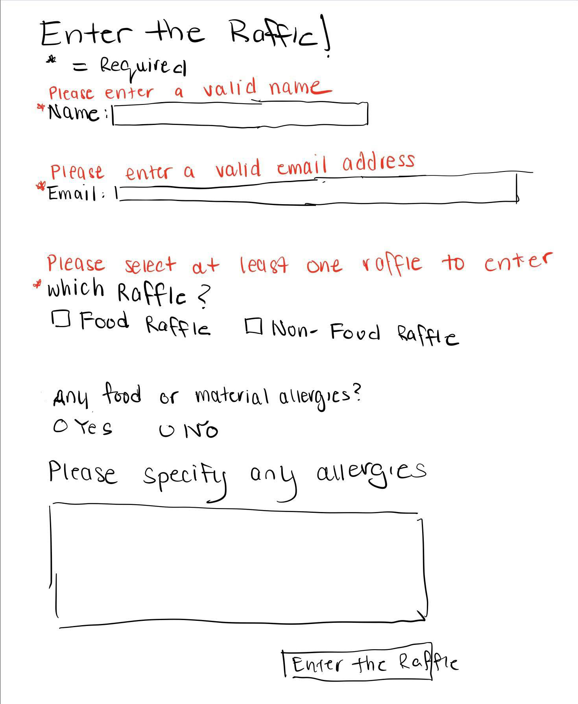

**Mobile Feedback**

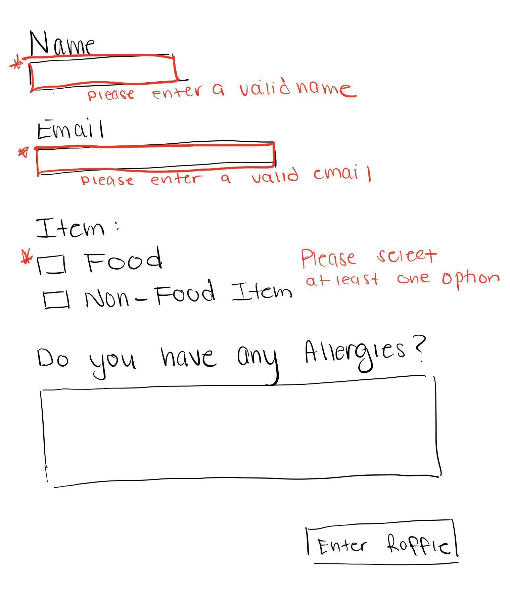


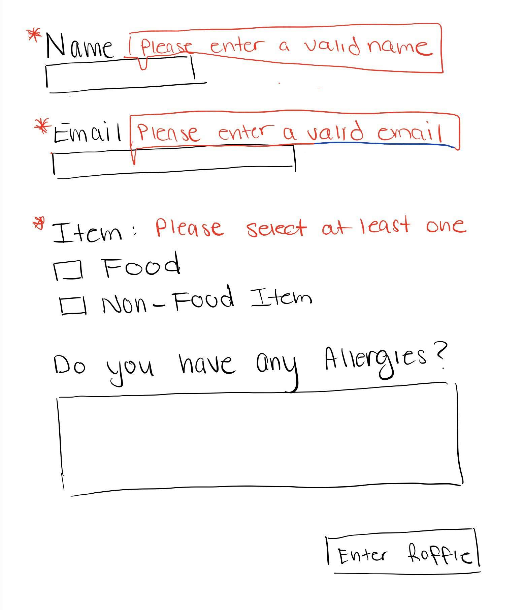

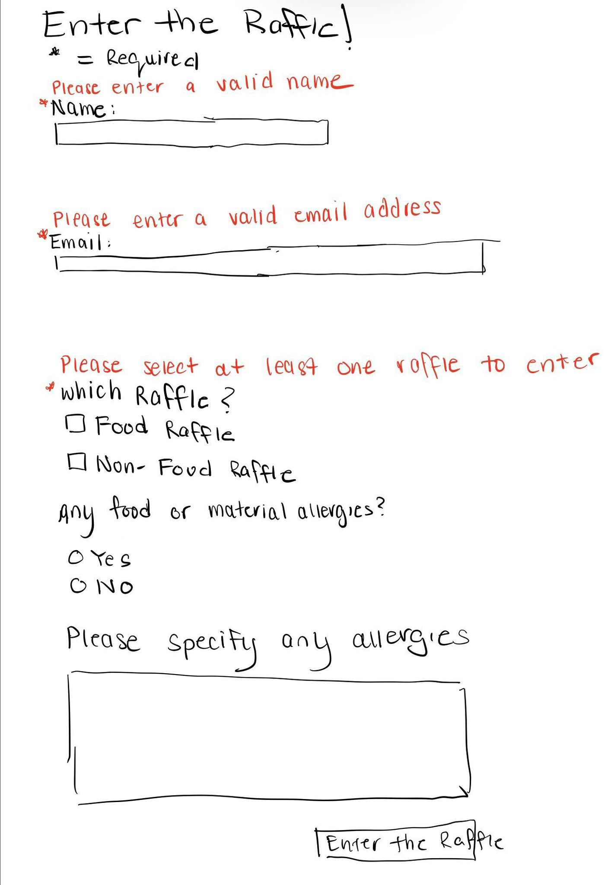


## Form Implementation Planning (Milestone 1)
> What submission method will your form use? GET or POST. Explain your reasoning.

I will be using post as I do not want the user's email to be publically seen, especially if they send the link to their friend or share it. Additionally, they may not want to have their medical information shared in case they do fill out the allergy section.

> For your site's `<form>` element, plan all HTML attributes that you will need and their values. Hint: action=, method=, novalidate

- `form action="https://www.cs.cornell.edu/courses/cs1300/2020fa/submit.php"`
- `method= "post"`
- `novalidate`


## Additional Information (Milestone 1)
> (optional) Include any additional information, justifications, or comments we should be aware of.

TODO


## Plan Validation Pseudocode (Final Submission)
> Write your form validation pseudocode here.

```
when user submits form:

	if name component is valid:
		hide name feedback
	else
		show name feedback

	if email component is valid:
		hide email feedback
	else
		show email feedback

    if at least one box is checked:
		hide item feedback
	else
		show item feedback

    if yes is selected
        show textarea

    if no is selected
        hide textarea

	send form to server if form is valid
```


## Additional Design Justifications (Final Submission)
> If you feel like you haven’t fully explained your design choices in the final submission, or you want to explain some functions in your site (e.g., if you feel like you make a special design choice which might not meet the final requirement), you can use the additional design justifications to justify your design choices. Remember, this is place for you to justify your design choices which you haven’t covered in the design journey. Use it wisely. However, you don’t need to fill out this section if you think all design choices have been well explained in the final submission design journey.

I originally did not have the radio button with the textarea, but I decided to include it as it made no sense to have an textarea asking for allergies if the user didn't' have any. I decided to only have the textarea appear if yes was selected in the radio buttons above. Additionally, I changed the allergies question to "Any Allergies" to avoid using you and refering to the user.


## Self-Reflection (Final Submission)
> This was the first project in this class where you coded some JavaScript. What did you learn from this experience?

JavaScript was pretty confusing, and I personally had a bit of trouble differentating which ones to use if I wanted the textarea to appear only if yes was selected. Through this experience, I learned about jquery and how to use it, which was a new experience. I had no idea that each layer of a website had their own language, and that javascript was what allowed interactivity on a website. I learned some basic JavaScript syntax and learned how Qjuery related to JS. Through this website, I also learned the many ways to debug javascript and make sure everything is linked togther, which proved helpful when attempting to code. Having the pseudocode typed out first also streamlined the process, making it easier for me to see which jquery snipplet goes where.


> Reflect on how HTML, CSS, and JavaScript together support client-side interactivity. If it's helpful, you can describe your mental model of client-side interactivity or explain how the general idea of showing and hiding content can be used to implement other forms of client-side interactivity beyond form validation and feedback.
JavaScript allows webpages to fit the needs of each user, and respond to the actions of the users. JavaScript modifies the html and css by adding classes and removing classes based on what the user clicks. For this class, we had JavaScript, HTML, and CSS as seperate files and had them interact with each other instead. Beyond form validation and feedback, the first example that comes to mind would be having notices on top of a webpage that can be x out by the user. This will allow them to receive important information about the webpage without altering the contents of the webpage. Another use could be showing and hiding the nav bar when the user clicks on something. JavaScript gives the website a lot more flexibility in presenting the materials of the website.


> Take some time here to reflect on how much you've learned since you started this class. It's often easy to ignore our own progress. Take a moment and think about your accomplishments in this class. Hopefully you'll recognize that you've accomplished a lot and that you should be very proud of those accomplishments!

Before coming into this class,  I had no idea how to code up and website and didn't even know what CSS and JavaScript was, but by the end of this class, I've coded up two websites, with one including some simple JavaScript. I've learned a lot about the frameworks of websites and even the internet and how webpages are sent to each individual computer. I had no idea there were so many layers to websites, which I've learned a lot about this semester. I am now able to code up a website and style it, which is a pretty important skill. I also learned about using git and github through this class, which will be helpful for future projects when they're done over an extended period of time.
